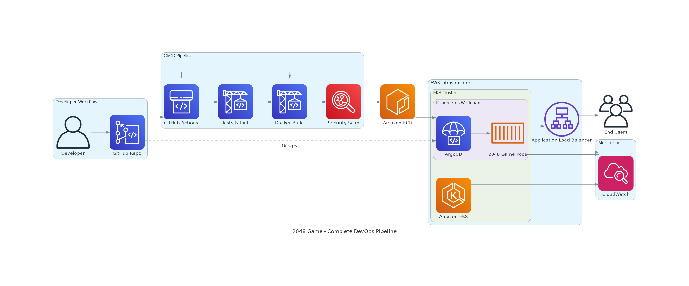
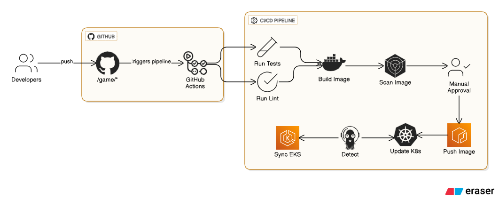

# 🎮 2048 Game - DevOps Edition

<p align="center">
  
  
  
  
  
</p>


A DevOps-enhanced version of the classic **2048 browser game**, productionized with Docker, Kubernetes, ArgoCD GitOps, Terraform-based AWS EKS infrastructure, GitHub Actions CI/CD, security scanning, SBOM generation, and optional AI-ready release summaries.

The game recipe is intentionally kept simple: static **HTML, CSS, and JavaScript** served by NGINX. The upgrade is focused on the real-world DevOps workflow around the app.

---

> **Portfolio CI note:** This final GitHub-ready version keeps one lightweight auto-running validation workflow on push. Heavier CodeQL, dependency review, and Terraform checks are kept as manual/advisory workflows to avoid noisy first-upload failures while still showing modern DevOps practices.

## 📸 Project Snapshots

### Cloud-Native Flow



### CI/CD Pipeline



---

## 🚀 What This Project Demonstrates

- Containerizing a static web app using Docker and NGINX
- Running the app on Kubernetes with health checks, resource limits, HPA, PDB, and NetworkPolicy
- Managing AWS infrastructure using Terraform
- Deploying to EKS with GitOps using ArgoCD
- Validating the project using GitHub Actions
- Documenting DevSecOps practices such as Trivy, CodeQL, Dependency Review, and SBOM generation
- Using stable Terraform tags and `.gitignore` rules to avoid state/secrets exposure
- Adding AI-ready release summary automation for modern platform engineering workflows

---

## 🧱 Architecture

```text
Developer Commit
      |
      v
GitHub Actions CI/CD
      |
      |-- Test / Lint / HTML validation
      |-- Docker build
      |-- Trivy scan + SBOM
      |-- CodeQL security analysis
      |
      v
Container Registry
      |
      v
ArgoCD GitOps Sync
      |
      v
AWS EKS Cluster
      |
      v
NGINX Ingress -> Kubernetes Service -> 2048 Game Pods
```

---

## 🛠️ Tech Stack

| Area | Tools |
|---|---|
| Application | HTML, CSS, JavaScript |
| Web server | NGINX unprivileged container |
| Containerization | Docker |
| CI/CD | GitHub Actions |
| Security | Trivy, CodeQL, Dependency Review |
| SBOM | Trivy CycloneDX |
| Infrastructure | Terraform |
| Cloud | AWS EKS, ECR, VPC |
| Kubernetes Delivery | Kustomize, ArgoCD GitOps |
| Optional AI Ops | Offline AI-ready release summary script |

---

## 📁 Project Structure

```text
.
├── .github/workflows/          # Safe auto validation + manual advisory DevSecOps workflows
├── argocd/                     # ArgoCD AppProject and Application manifests
├── docs/                       # Architecture, runbook, screenshots, GenAI notes
├── game/                       # Original 2048 static game + Docker/NGINX hardening
│   ├── js/                     # Game JavaScript
│   ├── style/                  # Game styles
│   ├── Dockerfile              # Productionized static site container
│   ├── nginx.conf              # Health endpoint + security headers
│   └── scripts/smoke-test.js   # Lightweight validation test
├── img/                        # Existing project snapshots used in README
├── infra/                      # Terraform AWS EKS/ECR/ArgoCD infrastructure
├── k8s/                        # Kubernetes manifests managed by Kustomize
├── scripts/                    # AI-ready release summary helper
├── README.md
├── SECURITY.md
└── PORTFOLIO_NOTES.md
```

---

## ⚡ Run Locally with Docker

```bash
cd game

docker build -t game-2048 .
docker run --rm -p 8080:8080 game-2048
```

Open:

```text
http://localhost:8080
```

Health check:

```bash
curl http://localhost:8080/healthz
```

---

## 🧪 Local Validation

```bash
cd game
npm test
npm run lint
```

The smoke test checks that the main game assets exist and that `index.html` references the required JavaScript and CSS files.

---

## ☸️ Deploy to Kubernetes

```bash
kubectl apply -k k8s/
kubectl rollout status deployment/game-2048 -n game-2048
kubectl get pods,svc,ingress -n game-2048
```

The Kubernetes layer includes:

- Namespace with restricted pod-security labels
- Deployment with rolling updates
- Non-root container security context
- Readiness and liveness probes on `/healthz`
- ClusterIP service
- NGINX ingress
- HorizontalPodAutoscaler
- PodDisruptionBudget
- NetworkPolicy

---

## 🔁 GitOps with ArgoCD

```bash
kubectl apply -f argocd/project.yaml
kubectl apply -f argocd/application.yaml
```

ArgoCD continuously watches the Git repository and keeps the cluster aligned with the desired state defined in the `k8s/` folder.

Update the repo URL in `argocd/application.yaml` if your GitHub repository name is different.

---

## 🏗️ Provision AWS Infrastructure with Terraform

```bash
cd infra
cp terraform.tfvars.example terraform.tfvars
terraform init
terraform fmt -recursive
terraform validate
terraform plan
terraform apply
```

Terraform provisions AWS infrastructure such as:

- VPC with public/private subnets
- EKS cluster with Auto Mode style configuration
- ECR repository for the game image
- NGINX ingress controller
- cert-manager
- ArgoCD installation

> Terraform state files are intentionally ignored and should not be committed to GitHub.

---

## 🔐 GitHub Actions and DevSecOps

This final upload-safe version includes one lightweight workflow that runs automatically on push and validates the static game, JavaScript syntax, required DevOps files, and the AI-ready helper script.

Manual/advisory workflows are also included for CodeQL, dependency review notes, and Terraform quality checks. This keeps the first GitHub upload clean while still documenting current DevOps and DevSecOps practices.

For AWS deployments, prefer GitHub Actions OIDC instead of long-lived AWS access keys.

---

## 🤖 AI-Ready Release Summary

Generate a local release-risk summary:

```bash
python scripts/genai_release_summary.py
```

The script works offline and produces `release-summary.json`. In a real environment, this output can be passed to an approved GenAI service such as Amazon Bedrock, Azure OpenAI, or an internal AI gateway to create release notes, deployment risk summaries, and rollback recommendations.

---

## 📚 Documentation

- [Architecture](docs/ARCHITECTURE.md)
- [Runbook](docs/RUNBOOK.md)
- [GenAI Enhancement](docs/GENAI_ENHANCEMENT.md)
- [Screenshots Guide](docs/SCREENSHOTS.md)
- [Security Policy](SECURITY.md)
- [Portfolio Notes](PORTFOLIO_NOTES.md)

---

## 🧹 Cleanup

For Kubernetes resources:

```bash
kubectl delete -k k8s/
```

For AWS infrastructure:

```bash
cd infra
terraform destroy
```

---

## 📌 Career Value

This project shows career progression from a simple static game to a production-style DevOps platform workflow. It demonstrates containerization, Kubernetes deployment, GitOps, IaC, CI/CD, DevSecOps scanning, SBOM generation, and AI-ready release automation.

---

<p align="center">
  
</p>

<h2 align="center">🤝 Connect With Me</h2>

<p align="center">
  <em>
    Thanks for visiting this project! I’m continuously building hands-on DevOps, Cloud, Automation, and AI-enabled engineering projects to improve real-world deployment, monitoring, and infrastructure skills.
  </em>
</p>

<p align="center">
  
</p>

<p align="center">
  <a href="https://github.com/yugandhar99" target="_blank" rel="noopener noreferrer">
    
  </a>
  <a href="https://www.linkedin.com/in/yugandhar-devops" target="_blank" rel="noopener noreferrer">
    
  </a>
  <a href="https://yugandhar-portfolio-psi.vercel.app/" target="_blank" rel="noopener noreferrer">
    
  </a>
  <a href="mailto:yugandharethamukkala1999@gmail.com">
    
  </a>
</p>

<p align="center">
  
  
  
  
</p>

---

<p align="center">
  ⭐ If this project added value, feel free to star the repository and connect with me!
</p>

<p align="center">
  <strong>Built with ❤️ using modern DevOps practices</strong>
</p>


